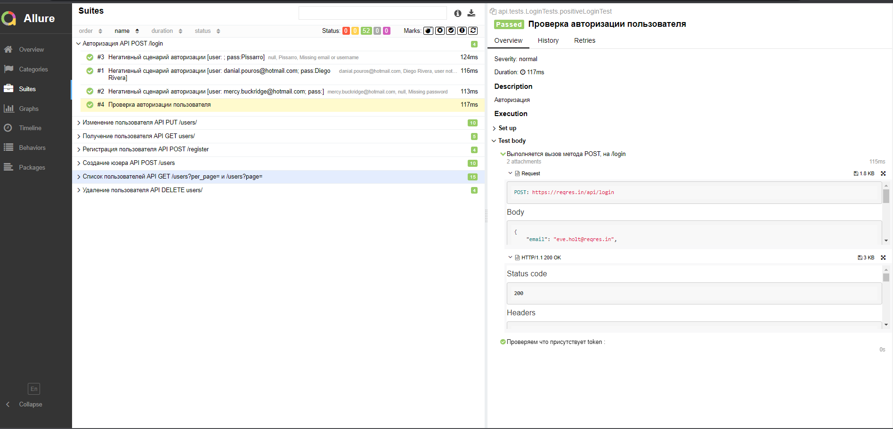
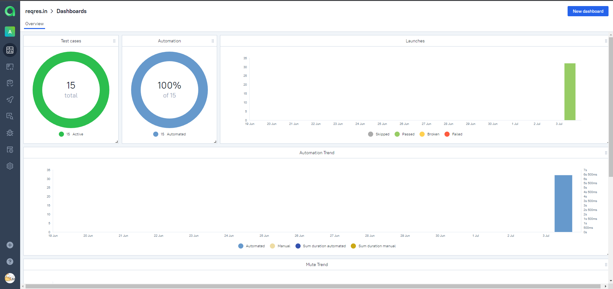
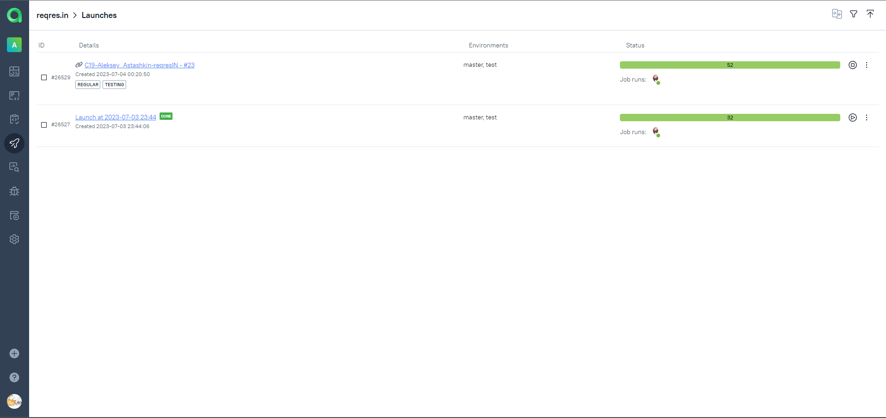
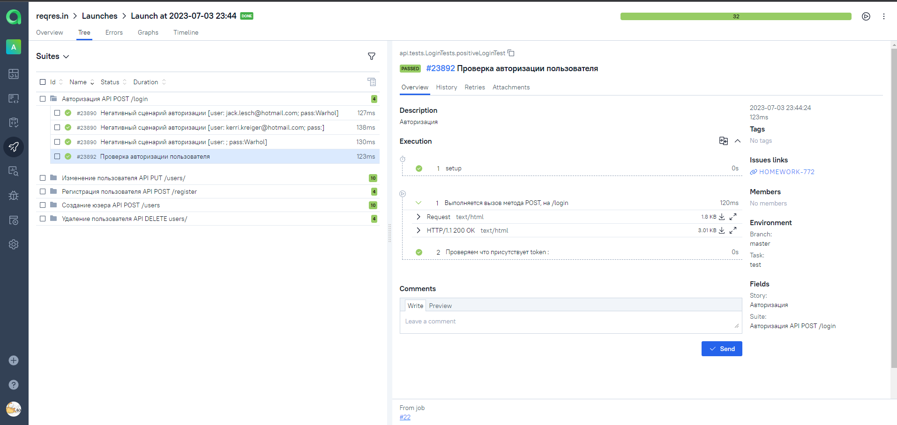
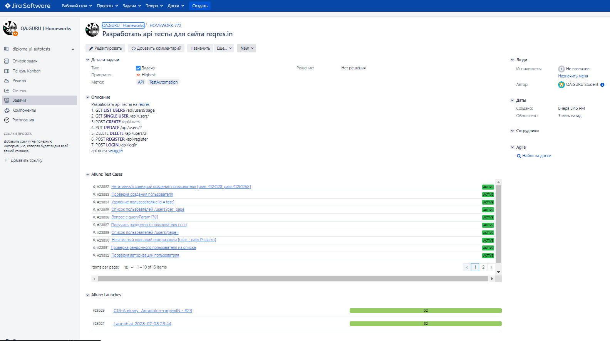
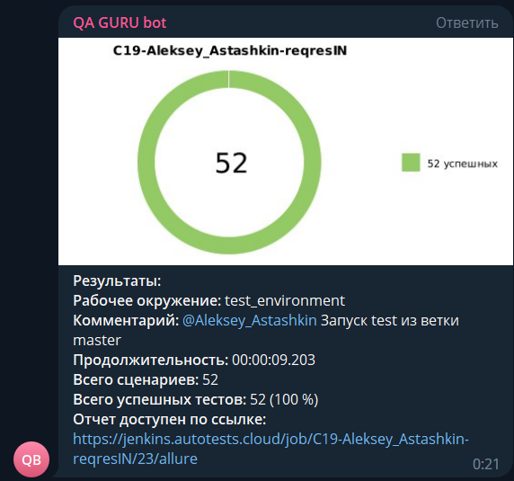

# Проект по автоматизации тестирования API на [Reqres](https://reqres.in/)


## :pushpin: Содержание:

- [Используемый стек](#computer-используемый-стек)
- [Запуск автотестов](#arrow_forward-запуск-автотестов)
- [Сборка в Jenkins](#-сборка-в-jenkins)
- [Пример Allure-отчета](#-пример-allure-отчета)
- [Интеграция с Allure TestOps](#-интеграция-с-allure-testOps)
- [Интеграция с Jira](#-интеграция-с-jira)
- [Уведомления в Telegram](#-уведомления-в-telegram)

## :computer: Используемый стек

<p align="center">


</p>

- Тесты в данном проекте написаны на языке <code>Java</code> с использованием фреймворка для
  тестирования [RestAssured](https://rest-assured.io/)
- В качестве сборщика был использован [Gradle](https://gradle.org/)
- [JUnit5](https://junit.org/junit5/) задействован в качестве фреймворка модульного тестирования
- Для удаленного запуска реализована джоба в [jenkins](https://www.jenkins.io/) с формированием Allure-отчета и
  отправкой результатов в <code>Telegram</code> при помощи бота
- Осуществлена интеграция с [Allure TestOps](https://docs.qameta.io/allure/)
- Также интегрирован с инструментом управления проектами [jira](https://www.atlassian.com/ru/software/jira)

## :arrow_forward: Запуск автотестов

### Варианты запуска тестов

- ```test``` -Запуск всех тестов
- ```sanity``` -Запуск тестов sanity

### Запуск тестов из терминала

```
gradle clean test
```

При выполнении команды тесты запустятся локально.

##  [Сборка в Jenkins](https://jenkins.autotests.cloud/job/C19-Aleksey_Astashkin-reqresIN/build?delay=0sec)

### Параметры сборки

* <code>TASK</code> – выбор запуска тестов. По-умолчанию запуск всех тестов - <code>test</code>.
* <code>BRANCH</code> – ветка на GitHub. По-умолчанию установлена ветка - <code>master</code>.

<p align="center">

</p>

##  Пример Allure-отчета

#### Главная страница отчета Allure содержит следующие блоки:

- <code><strong>*ALLURE REPORT*</strong></code> - отображает дату и время теста, общее количество запущенных тестов, а
  также диаграмму с процентом и количеством успешных, упавших и сломавшихся в процессе выполнения тестов
- <code><strong>*TREND*</strong></code> - отображает тенденцию выполнения тестов для всех запусков
- <code><strong>*SUITES*</strong></code> - отображает распределение тестов по сьютам
- <code><strong>*CATEGORIES*</strong></code> - отображает распределение неудачных тестов по типам дефектов

<p align="center">
  
</p>
<p align="center">

</p>

### Результат выполнения теста содержит:

- Request с вложением ```Метод запроса, Адрес, Headers, Curl```
- Response с вложением ```Status code, Headers, Body```

<p align="center">

</p>

##  [Интеграция с Allure TestOps](https://allure.autotests.cloud/project/3457/launches)

#### На вкладке Dashboards отображается:

- Количество тест-кейсов и их статус
- Соотношение ручных/автоматизированных тестов
- Результаты запусков/прохождения тестов в графике по датам

<p align="center">

</p>

#### На вкладке Launches можно увидеть:

- Результаты запусков автоматизированных тестов
- Результаты запуска тестов из Allure TestOps

<p align="center">

</p>

Результаты выполнения отдельных тестов:

- Шаги теста
- Request с вложением ```Метод запроса, Адрес, Headers, Curl```
- Response с вложением ```Status code, Headers, Body```

<p align="center">

</p>

##  [Интеграция с Jira](https://jira.autotests.cloud/browse/HOMEWORK-772)

Реализована интеграция <code>Allure TestOps</code> с <code>Jira</code>. В задаче отображаются прикреплённые к ней
тест-кейсы, а также результаты запусков/прохождения тестов.
<p align="center">

</p>

###  Уведомления в Telegram

После завершения сборки, бот, созданный в <code>Telegram</code>, автоматически обрабатывает и отправляет сообщение с
результатом.
<p align="center">

</p>